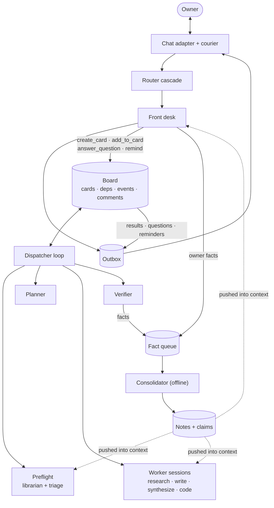
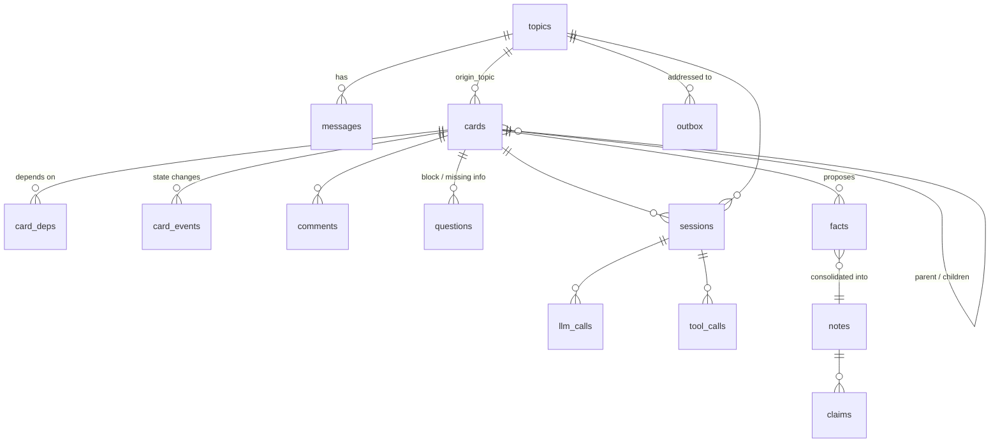
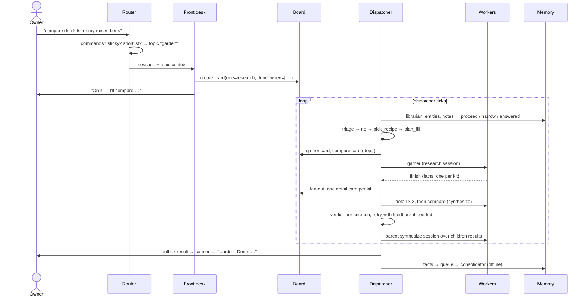
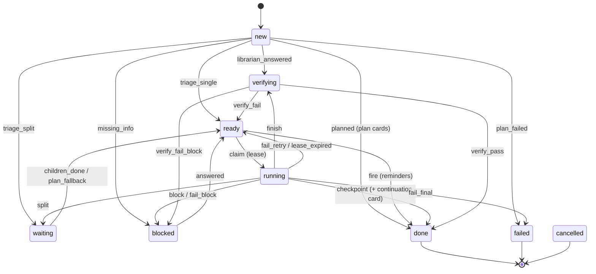

# Architecture

How the Sandman v5 prototype is built. The design it implements is
[DESIGN.md](DESIGN.md); where the prototype differs, see
[DEVIATIONS.md](DEVIATIONS.md). What each model role sees and may do is in
[ROLES.md](ROLES.md); how well it works is in [BENCH.md](BENCH.md).

## The idea in one paragraph

The harness is the brain, the model is a function. All control flow (what
runs next, when work is done, where a message goes, what is remembered) is
plain Python over one SQLite database. The model is called for one small
decision at a time, with a short role prompt and an output schema enforced
by constrained decoding. Agents never talk to each other: all work goes
through a **board** of cards. The human talks to exactly one role, the **front
desk**, in **topics**. **Memory** is written offline by a consolidator and
pushed into sessions by the harness.

## Components

Every box that thinks (router, front desk, preflight, planner, workers,
verifier, consolidator) calls the model only through the **LLM gateway**
(`llm.py`), and every call is recorded by **trace.py** for the web UI.

## Module map

| Module | Lines | Responsibility |
|---|---|---|
| `llm.py` | 160 | Gateway: OpenAI-compatible HTTP (OpenRouter or a local server), `response_format: json_schema`, local validation, retry once, plain-text mode, logging |
| `calls.py` | 450 | Call catalog: one function per call type; renders the prompt, builds the schema (dynamic enums, unions, restrictions), adds code checks |
| `prompts.md` | | Every prompt, one section per call type |
| `db.py` | 130 | SQLite schema, JSON columns, small migration, transactions |
| `board.py` | 140 | Cards, dependencies, comments, the state machine (one transition table), leases, limits |
| `dispatcher.py` | 300 | The work loop: picks a runnable card and runs preflight / planner / worker / verifier; applies terminal actions; retries and escalation; reporting |
| `worker.py` | 90 | The worker loop (one action per call), role toolsets, transcript truncation, loop guard, file writing |
| `tools.py` | 160 | Tools: fake/live web, artifact store, work-folder files, `run` |
| `verifier.py` | 60 | Typed `done_when`: deterministic checks, then one judge per criterion |
| `conversation.py` | 440 | Router cascade, front desk loop and tools, questions, outbox, courier, commands, reminders, time parsing |
| `memory.py` | 265 | Notes and claims, retrieval (exact + FTS5), librarian preflight, fact queue, consolidator, forgetting |
| `recipes.py` | 60 | Seed recipes and their parameters |
| `trace.py` | 40 | Sessions and tool calls; tags LLM calls with session/card/topic |
| `web.py` | 710 | Read-only web UI |
| `__main__.py` | 115 | CLI: `chat`, `card`, `board`, `show`, `consolidate`, `notes`, `web` |

## Data model

One SQLite file (`<home>/sandman.db`, WAL mode) plus a workspace folder
(`<home>/workspace/<root card>/`) for artifacts and code work folders.

| Table | Holds |
|---|---|
| `cards` | the contract (title, goal, done_when, constraints, inputs, role, kind), tree position (parent, root, depth), state, phase, attempt, recipe info, lease, result |
| `card_deps`, `card_events`, `comments` | dependency edges; every transition with payload; guidance, verifier feedback, owner answers |
| `topics`, `messages` | subjects with rolling summary; every message in/out with routing stage, confidence, provisional flag |
| `questions`, `outbox` | owner questions with handles (Q3) and answers; every outbound message addressed to a topic |
| `notes`, `claims`, `facts`, `review_items` | memory: notes made of claims (source, date, volatility, status, corroborations); the fact queue with each consolidator decision; conflicts for the owner |
| `sessions`, `tool_calls`, `llm_calls` | tracing: every step, every tool call, every model call with full prompt, schema, raw and parsed output, provider, tokens, cost, latency |
| `notes_fts` | FTS5 index over note titles, aliases, one-liners and claims |

## Life of a request

## The card state machine

All transitions live in one table (`board.TRANSITIONS`); `board.transition`
writes the card and a `card_events` row in one transaction. A transition that
isn't in the table raises.

Any non-terminal card can be cancelled (children recursively). Limits
(`board.py`): depth 3, 5 children per split, 2 attempts, 4 continuations, 25
open cards per tree, 300 s leases.

## The dispatcher loop

`Dispatcher.tick()`: reclaim expired leases → fire due reminders → move
waiting cards whose children are all terminal to `ready` (phase
`synthesize`) → pick the highest-priority runnable card (dependencies done)
and run one session for it:

| Card state | Session | What happens |
|---|---|---|
| `new`, kind task | **preflight** | librarian (may answer from memory or narrow the goal), triage (single / split into a plan card / ask for missing info) |
| `new`, kind plan | **planner** | recipe mode (`plan_fill`, harness instantiates steps and fans out later) or free mode (`plan_generate`) |
| `ready` | **worker** | claim + lease, build the context pack, run the worker loop, apply the terminal action |
| `verifying` | **verifier** | deterministic checks, then judges; pass → done (facts queued, fan-out, root reports to its topic); fail → retry with feedback → large model → ask the owner |

Every session is wrapped in `trace.session(...)`, so its LLM calls and tool
calls are linked to it and its outcome is recorded.

The prototype runs the dispatcher in the chat process between owner
messages, single-threaded (one model slot). The design's slots, priorities
and interactive reservation are future work.

## The LLM gateway

`Gateway.call(call_type, system, user, schema, …)`:

1. POST to `/chat/completions` with `response_format: json_schema` (strict),
   `max_tokens`, thinking off by default. On OpenRouter:
   `provider.require_parameters`, optional provider order via
   `SANDMAN_PROVIDERS`.
2. Transport retries with backoff (429/5xx); a cut-off output counts as invalid.
3. Parse, truncate over-long strings (providers don't enforce `maxLength`),
   validate against the schema, run the call type's code check.
4. On failure, retry **once** at temperature 0; then raise `LLMFailure`, which
   every caller turns into a state transition (never an unhandled crash).
5. Log every attempt (with the current trace context).

`schema=None` makes a plain-text call; used only for file contents.
Provider quirks found by the benchmark, and their workarounds, are in
DEVIATIONS.md ("Additions found necessary by the benchmark").

## Memory

**Write path (offline):** worker results, checkpoints and owner statements
put candidate facts into `facts`. `memory.consolidate` resolves each fact's
subject to a note (exact match → `match_subject` → new note), applies the
relevance rubric (keep rule in code), decides new / duplicate / update /
contradicts against the note's claims, applies the contradiction policy
(evergreen or weaker-source conflicts become disputed + a review item; owner
facts win), and regenerates one-liners. Nothing is deleted: claims are
superseded, disputed or retracted (`/forget`).

**Read path (push):** before a card runs, the librarian retrieves notes by
entity name and FTS5 and may answer or narrow the card. Workers and the front
desk get the relevant notes *with their claims* in the context (stale claims
marked "old"); there is no memory tool to call.

## Conversation

The router cascade decides most messages without the model (commands,
selector, question handles); sticky and shortlist calls handle the rest, and
guesses are shown as `(topic?)` with a one-word correction (`→ slug`, `→ new`)
that also moves the cards created from that turn. Every outbound message goes
through the outbox, addressed to a topic, never to a channel; the courier
labels it with `[slug]`. The front desk is stateless between turns;
continuity comes from the topic summary, recent messages and card lines.

## Tools and workspace

Each root card tree has a workspace folder. Artifacts are files with an index
(`artifacts.json`: id, name, card, size, first 100 chars). Long web pages are
saved as artifacts and read in 2500-character windows. Code cards get a work
folder; `run` executes there with a timeout (no container in the prototype).
The web is either live (DuckDuckGo HTML + fetch) or a fixed fake corpus
(`--fake-web bench`) for deterministic runs.

## Observability: tracing and the web UI

`trace.py` keeps a context variable with the current session; the gateway
adds it to every LLM call record, and tools called inside the session are
stored with the call that chose them. `python -m sandman --home H web`
serves a read-only UI over the database and workspace:

| Page | Shows |
|---|---|
| Overview | counts, card states, running cards, recent sessions, events and calls |
| Board | card trees, a column view by state, a table; reminders |
| Card | goal, done_when (and how the verifier classifies it), result, sessions, events, children, dependencies, comments, questions, the inputs the next session will see, LLM calls, outbox, facts, artifacts, work folder, the full row |
| Topics / topic | messages with routing stage and confidence, cards, questions, outbox, sessions |
| Sessions / session | the timeline: each LLM call (output, prompt) followed by the tool calls it chose (arguments, result, ms) |
| LLM calls / call | every call; system prompt, gateway hint, user prompt, schema, raw and parsed output, provider, tokens, cost |
| Stats | calls, invalid rate, latency, tokens, cost by call type, model, provider and session type; tool usage |
| Memory / note / facts | profile, notes, all claims with provenance and status, what sessions see, fact queue with decisions, review items |
| Artifacts, Events, Prompts & roles, Config | files, all card events, live prompts/toolsets/schemas, limits, transition table, recipes, environment |

Every id on every page is a link; the search box takes an id or text.

## Tests and benchmark

- `tests/test_harness.py`: the harness with a scripted fake model: state
  machine, single card end to end (including tracing), retries and
  escalation, recipe fan-out and join, routing, corrections, questions,
  consolidation, paging, plain-text file writes, guards.
- `bench/`: 173 tasks through the real prompts, schemas and loops against a
  real model; quick set by default, `--full` for all. Reports include pass
  rates per role and call type, invalid-output rates, latency and cost.
